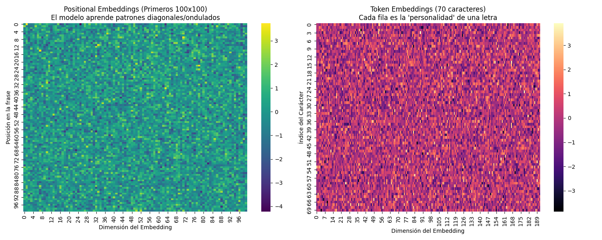

# SanchoGPT 🛡️📖

**SanchoGPT** es un modelo de lenguaje compacto basado en la arquitectura GPT (Generative Pre-trained Transformer), entrenado específicamente con el texto de *"El Ingenioso Hidalgo Don Quijote de la Mancha"* de Miguel de Cervantes.

El objetivo de este proyecto es explorar cómo un modelo pequeño puede aprender el estilo y vocabulario del español antiguo a nivel de caracteres.


## 🚀 Características

- **Arquitectura GPT**: Implementación desde cero en PyTorch (Self-Attention, Feed-Forward, LayerNorm).
- **Entrenamiento a nivel de carácter**: El modelo genera texto letra por letra.
- **Visualización**: Herramientas para inspeccionar los embeddings y la arquitectura.
- **Exportación**: Soporte para exportar a ONNX y visualizar en 3D.

## 🛠️ Instalación

Asegúrate de tener Python instalado. Las dependencias principales son:

```bash
pip install torch matplotlib seaborn numpy
```

## 💻 Uso

El proyecto consta de varios scripts para diferentes propósitos:

### 1. Entrenamiento (`sancho_model.py`)
Entrena el modelo desde cero. Si lo ejecutas directamente, comenzará el bucle de entrenamiento y guardará el modelo en `ckpt.pt`.

```bash
python sancho_model.py
```

### 2. Generación de Texto (`gen.py`)
Carga el modelo entrenado (`ckpt.pt`) y genera texto al estilo de Cervantes.

```bash
python gen.py
```

### 3. Visualización de Embeddings (`view.py`)
Genera mapas de calor para visualizar qué ha aprendido el modelo sobre la posición y los caracteres.
- Genera: `model_internals.png`

```bash
python view.py
```



### 4. Exportación de Vectores 3D (`3dview.py`)
Exporta los embeddings a archivos TSV (`vectors.tsv` y `metadata.tsv`) para visualizarlos en herramientas como [TensorFlow Projector](https://projector.tensorflow.org/).

```bash
python 3dview.py
```

### 5. Exportación a ONNX (`onnx.py`)
Exporta la arquitectura del modelo al formato ONNX para visualizar el grafo computacional en herramientas como [Netron](https://netron.app/).
- Genera: `sancho_architecture.onnx`

```bash
python onnx.py
```


## 📂 Estructura del Proyecto

- `sancho_model.py`: Definición del modelo GPT y lógica de entrenamiento.
- `gen.py`: Script de inferencia para generar texto.
- `view.py`: Visualización de embeddings con Matplotlib/Seaborn.
- `3dview.py`: Exportación de metadatos para visualización 3D.
- `onnx.py`: Exportación del modelo a ONNX.
- `datos_sancho_mini.txt`: Dataset de entrenamiento (fragmento del Quijote).
- `ckpt.pt`: Pesos del modelo entrenado (checkpoint).
