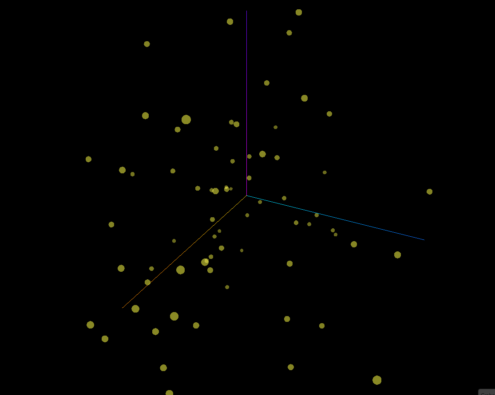

# SanchoGPT 🛡️📖


**SanchoGPT** es una implementación minimalista y educativa de un modelo de lenguaje tipo Transformer (NanoGPT), entrenado desde cero para replicar el estilo y vocabulario del español del Siglo de Oro, basado en el texto de *"El Ingenioso Hidalgo Don Quijote de la Mancha"*.

Este proyecto explora los fundamentos de la **Inteligencia Artificial Generativa** a bajo nivel: tokenización por caracteres, mecanismos de atención y ajuste fino (Fine-Tuning) para chat.


*(Visualización del proceso de generación de texto)*

## 🧠 Arquitectura y Especificaciones

El modelo está construido sobre PyTorch siguiendo la arquitectura *Decoder-only Transformer* (similar a GPT-2).

| Parámetro | Valor | Descripción |
| :--- | :--- | :--- |
| **Arquitectura** | NanoGPT | Implementación basada en el trabajo de Andrej Karpathy. |
| **Tokenización** | Carácter (Char-level) | Vocabulario de ~90 tokens únicos. |
| **Embeddings** | 192 dimensiones | Tamaño del vector vectorial. |
| **Contexto** | 256 tokens | Ventana de atención máxima. |
| **Capas / Cabezas** | 4 capas / 4 cabezas | Estructura del Transformer. |
| **Parámetros** | ~0.15 M | Modelo extremadamente ligero. |
| **Hardware** | NVIDIA RTX 5070 Ti | Entrenamiento optimizado con CUDA. |

## 🚀 Características

- **Entrenamiento Base (Pre-training):** Aprende la gramática y estilo de Cervantes a partir de texto plano.
- **Modo Chat (Fine-Tuning):** Capacidad experimental de responder preguntas siguiendo el formato `<|usuario|>` / `<|sancho|>`.
- **Inferencia Eficiente:** Generación de texto en tiempo real en CPU o GPU.
- **Introspección:** Scripts para exportar pesos a ONNX y visualizar embeddings en 3D.

## 🛠️ Instalación

1. Clonar el repositorio:
   ```bash
   git clone [https://github.com/tu_usuario/sanchoGPT.git](https://github.com/tu_usuario/sanchoGPT.git)
   cd sanchoGPT
   ```

2. Crear entorno virtual e instalar dependencias:
   ```bash
   python -m venv venv
   source venv/bin/activate # o .\venv\Scripts\activate en Windows
   pip install torch matplotlib seaborn numpy
   ```

## 💻 Flujo de Trabajo

El proyecto se divide en dos fases: Entrenamiento del Modelo Base y Ajuste para Chat.

### Fase 1: El Modelo Base (Escritor)

Entrena el modelo para que aprenda a escribir como Cervantes.

1. **Entrenar:**
   ```bash
   python model/sancho_model.py
   ```
   *Esto generará `model/ckpt.pt`.*

2. **Generar Texto (Inferencia):**
   ```bash
   python gen.py
   ```
   *Salida de ejemplo:*
   > "En un lugar de la mancha de cuyo nombre no quiero acordarme..."

### Fase 2: Sancho Chat (Conversacional) 🧪

Una capa experimental para dotar al modelo de capacidad de interacción pregunta-respuesta.

1. **Preparar Dataset:**
   Convierte el dataset JSON a formato de texto con tokens especiales.
   ```bash
   python data/json2txt.py
   ```

2. **Fine-Tuning (SFT):**
   Refina el modelo base con el dataset de diálogo.
   ```bash
   python entrenar_chat.py
   ```
   *Esto generará `sancho_chat.pt`.*

3. **Chatear:**
   Interfaz de consola interactiva.
   ```bash
   python chat_console.py
   ```

## 📊 Visualización e Ingeniería Inversa

Herramientas para entender qué ocurre dentro de la "caja negra".

### Mapa de Calor de Embeddings
Visualiza la similitud entre caracteres aprendida por el modelo.
```bash
python visualization/view.py
```


### Exportación a ONNX
Exporta el grafo computacional para inspección en [Netron](https://netron.app/).
```bash
python visualization/onnx.py
```


## ⚠️ Limitaciones y Aprendizajes

Este proyecto es una prueba de concepto académica con las siguientes limitaciones conocidas:
- **Tokenización por Caracteres:** Al no usar BPE (Byte Pair Encoding), el modelo tiene dificultades para mantener la coherencia semántica en frases largas o complejas.
- **Tamaño del Dataset:** Entrenado con un corpus pequeño (~150KB), lo que limita su "conocimiento del mundo" fuera del libro.
- **Alucinaciones:** En modo chat, puede inventar palabras o repetir bucles si la temperatura es alta.

## 📜 Créditos

- Inspirado y guiado por la **"Guía Completa: Cómo Crear un Modelo GPT desde Cero"** de **Gabriel Merlo** ([Ver vídeo](https://youtu.be/QK4AHZTVf68)).
- Basado en la serie "Zero to Hero" de **Andrej Karpathy** y su repositorio [nanoGPT](https://github.com/karpathy/nanoGPT).
- Texto original: Project Gutenberg (Don Quijote).

---
*Desarrollado con fines educativos en Ingeniería Robótica e IA.*